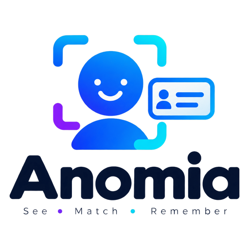

<p align="center">
  
</p>


Alat bantu instruktur dan tim training untuk mengenali dan memetakan peserta pelatihan lewat foto wajah dan denah ruang.

Upload foto peserta, sistem mendeteksi wajah dan mengusulkan nama (dari roster yang sudah diimpor atau dari kecocokan dengan foto lain), instruktur mengonfirmasi, lalu peserta ditempatkan di denah ruang training — lengkap dengan wajah, nama, dan detail tiap peserta.

Status: **prototipe lokal jalan, belum bisa dipakai tim.** Seluruh alur (roster → foto → deteksi → labeling → denah ruangan → cetak/bagikan) berfungsi di browser, tapi datanya masih tersimpan di IndexedDB satu browser saja — belum ada auth/database. Lihat [`docs/discovery.md`](docs/discovery.md) untuk pemahaman produk, domain model, dan rencana arsitektur secara lengkap.

## Menjalankan secara lokal

```bash
npm install   # juga meng-copy model deteksi wajah dari node_modules (postinstall)
npm run dev
```

Buka `http://localhost:3000`, buat kelas, import roster, lalu upload foto — deteksi wajah berjalan sepenuhnya di browser (tidak ada backend). Font sudah di-host sendiri (`@fontsource-variable`), jadi aplikasi tetap tampil benar tanpa akses ke Google Fonts (mis. Wi‑Fi ruang training yang terbatas).

## Alur & fitur

1. **Info kelas** — nama, jadwal, ruangan, perkiraan jumlah peserta, dan layout ruangan awal (pratinjau tiap template).
2. **Peserta & foto**
   - Tempel daftar dari Excel/Google Sheets/WA: kolom `Nama · Instansi · Jabatan · Email · No. HP` (dipisah TAB, `;`, atau `|`). Nomor urut & baris judul dilewati, duplikat dideteksi, ada pratinjau sebelum disimpan.
   - Detail peserta: instansi, jabatan, email, HP/WA, catatan.
   - Upload foto grup atau foto per orang (drag & drop). Foto di-encode ulang sehingga EXIF/GPS terbuang.
3. **Labeling wajah**
   - Foto ditampilkan utuh dengan semua kotak wajah: biru = sedang dipilih, oranye = belum dinamai, hijau = sudah dinamai (klik untuk mengubah).
   - Wajah mirip dikelompokkan; sekali pilih nama, semua ikut dinamai. Wajah yang salah kelompok bisa di-uncheck.
   - Usulan "Mungkin sama dengan" dari kecocokan wajah; nama yang sudah dipakai di foto yang sama otomatis diblok.
   - Tab **Perlu dinamai / Sudah dinamai / Diabaikan**, tombol **Lepas label**, **Pulihkan**, **Jadikan foto profil**.
   - **Urungkan** (tombol, notifikasi, atau Ctrl+Z) untuk semua aksi. Tidak ada lagi shortcut tunggal yang langsung membuang wajah.
   - Wajah tidak terdeteksi? **Tandai wajah** (gambar kotak manual) atau **Pindai ulang** foto dengan pemindaian lebih teliti.
4. **Denah ruangan**
   - Satu denah utuh per ruangan: layar & fasilitator di depan, semua meja di posisi sebenarnya, tiap kursi menampilkan **wajah + nama**; klik kursi untuk **detail peserta** (jabatan, instansi, email, WA, catatan).
   - Template sungguhan: Banquet, Classroom, U-Shape, Hollow Square, Conference, Theater, Custom — dihitung dari jumlah peserta.
   - Mode **Edit denah**: seret meja, putar, ubah bentuk & jumlah kursi, tambah/duplikat/hapus meja, atur ukuran ruangan.
   - Mode **Atur peserta**: seret wajah antar kursi (menukar tempat), atau ketuk nama lalu ketuk kursi (cocok untuk tablet/HP). Isi otomatis: campur instansi / acak / urut daftar.
   - Beberapa sesi (Day 1, Day 2, …): salin denah dengan posisi duduk sama, diacak (rotasi), atau dikosongkan. Sesi bisa dikunci.
   - **Mode hafalan**: nama disembunyikan, ketuk kursi untuk mengintip.
   - **Cetak / PDF** dan **Unduh gambar (PNG)** mencetak/membagikan *seluruh ruangan* dalam satu halaman, bukan per meja. Di HP tersedia tombol **Bagikan** (WhatsApp, email, dll).

## Prinsip inti

- **Instruktur/tim selalu yang memutuskan.** Sistem hanya mengusulkan kecocokan wajah-ke-nama; tidak pernah melakukan assignment otomatis.
- **Tidak ada face data yang keluar ke pihak ketiga.** Deteksi dan embedding wajah berjalan di browser, tidak ada panggilan ke API pengenalan wajah pihak ketiga.
- **Skala kecil, arsitektur sederhana.** Satu batch training = puluhan peserta. Tidak butuh vector database, tidak butuh GPU server, tidak butuh LLM di jalur inti.

## Stack

Next.js (App Router, TypeScript) · Tailwind CSS · [@vladmandic/human](https://github.com/vladmandic/human) untuk deteksi & embedding wajah di browser · Dexie (IndexedDB) untuk penyimpanan lokal sementara · lucide-react untuk ikon.

### Catatan deteksi wajah

BlazeFace (detektor di dalam Human) mengecilkan **seluruh** foto ke 256×256 sebelum mencari wajah, sehingga di foto kelas 20–30 orang wajahnya tinggal beberapa piksel dan banyak yang terlewat. Pipeline di [`src/face/humanPipeline.ts`](src/face/humanPipeline.ts) sekarang:

1. memindai foto dalam **ubin bertumpuk di beberapa skala** (`src/face/tiling.ts`), lalu menggabungkan duplikat dengan NMS;
2. memeriksa ulang tiap kandidat di crop yang diperbesar dengan mesh + descriptor — menolak false positive (motif baju, lampu) dan menghasilkan descriptor dari resolusi yang layak;
3. mengelompokkan wajah dengan *average linkage* + aturan "dua wajah di foto yang sama pasti orang berbeda" (`src/face/cluster.ts`).

Threshold kemiripan (`CLUSTER_THRESHOLD`, `SUGGEST_*`) masih hasil kalibrasi awal pada foto contoh Human — kalibrasi ulang dengan foto training asli (Fase 0 di discovery doc).

## Belum ada

Auth & akses tim, Postgres/object storage, mode drill "Siapa ini?", export/impor data (JSON). Detail dan urutan pengerjaan ada di bagian "Rencana implementasi bertahap" pada [`docs/discovery.md`](docs/discovery.md).
